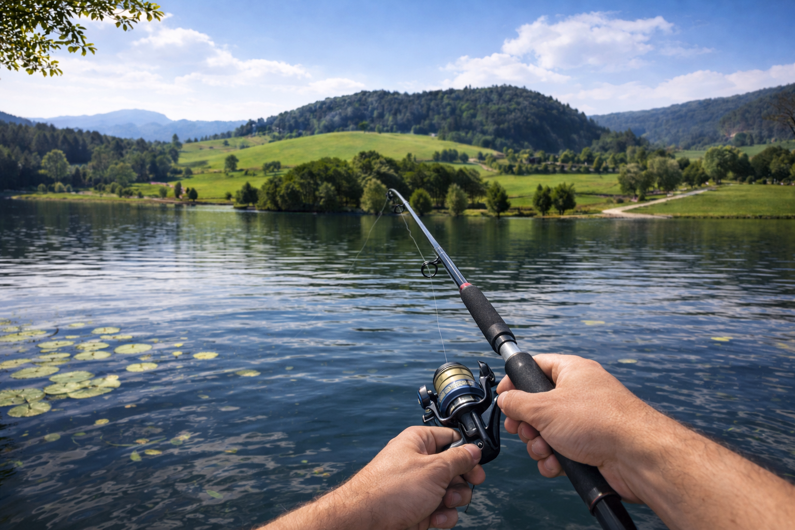
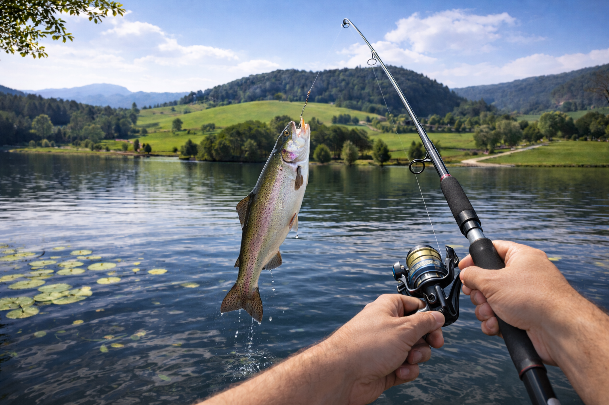
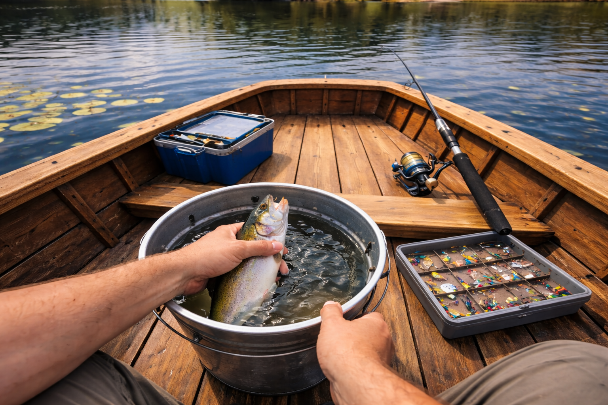

# Vizualizacija scena VR/AR aplikacije

## Scena 1: Pecanje – bacanje udice

**Opis:**
Korisnik vidi pogled iz prvog lica kako drži štap za pecanje iznad mirnog jezera, okruženog brdima i zelenilom.  
Korisnik može da pomera štap, zabacuje udicu i prati plovak na vodi.  
Svrha scene je da uvede korisnika u VR/AR okruženje i osnovnu mehaniku pecanja.

---

## Scena 2: Ulovi ribu

**Opis:**
Korisnik vidi kako se riba podiže iz vode zakačena na udicu, dok je štap zategnut.  
Korisnik može da namotava strunu, podiže štap i “izvuče” ribu iz vode.  
Svrha scene je glavna interakcija – simulacija trenutka ulova.

---

## Scena 3: Spremanje ulova

**Opis:**
Korisnik vidi svoje ruke kako spuštaju ribu u kofu sa vodom unutar čamca.  
Korisnik može da odloži ribu, pogleda opremu i nastavi pecanje.  
Svrha scene je da prikaže rezultat akcije i omogući nastavak igre.
